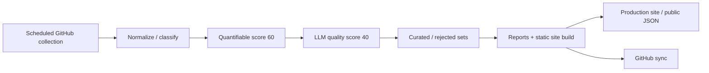

# Agent EcoRadar

English | [中文](README.md)

[](https://github.com/lzpgood123/agent-ecoradar/actions/workflows/update-data.yml)
[](https://github.com/lzpgood123/agent-ecoradar/actions/workflows/publish-site.yml)

> An always-on radar that scans, scores, and indexes the AI coding agent ecosystem.  
> **Not** an awesome list — a continuously running data pipeline.

**Site**: https://ecoradar.lzpgood.online/  
**Data**: 5,165 projects · 40 curated · 10 rejected · 10 target tools  
**Repo**: https://github.com/lzpgood123/agent-ecoradar  
**Version**: `2026.07.16`

---

## What it is

Agent EcoRadar continuously discovers, normalizes, scores, and presents resources across the AI coding agent ecosystem: plugins, MCP servers, skills, rules, CLI tools, agent frameworks, tutorials, and more.

| Lens | Meaning |
|------|---------|
| Eco | Ecosystem panorama across tools and resource types |
| Radar | Continuous scanning via scheduled collection + periodic deep analysis |
| Index | Searchable index via site filters / search / public JSON |

GitHub holds the full history and raw artifacts; the production site shows the current build.

---

## AI workflow



Public automation has two layers:

1. **Local scheduled jobs**: daily incremental collection & scoring; weekday incremental LLM quality analysis; Monday full LLM analysis with site deploy.
2. **GitHub Actions**: validation, site preview publishing, and quality-gate backup paths.

No hand-curated awesome list. Maintainers mainly tune target tools, queries, and policy.

---

## Coverage

### Target tools (10)

- Claude Code (`claude-code`)
- OpenAI Codex CLI (`codex-cli`)
- Antigravity / Gemini CLI (`antigravity-cli`)
- OpenCode (`opencode`)
- Goose (`goose`)
- Qoder (`qoder`)
- Trae (`trae`)
- WorkBuddy / CodeBuddy (`workbuddy-codebuddy`)
- Cursor (`cursor`)
- Hermes Agent (`hermes-agent`)

Tool index: [`docs/tool-index.md`](docs/tool-index.md)

### Resource types (`resource_type`)

Common types: `agent-framework`, `skills`, `cli-tool`, `mcp-server`, `tutorial`, `extension`, `rules`, and more.  
The site supports multi-select filters by tool and type.

### Tracking tiers (`tracking_priority`)

| Level | Meaning |
|-------|---------|
| `track` | Actively refreshed |
| `index` | Indexed, lower refresh priority |
| `pending` | Awaiting decision |
| `reject` | Low-value / noise direction |

---

## Scoring (100-point scale)

| Part | Points | Cadence |
|------|--------|---------|
| Quantifiable | 60 | Daily (stars, activity, source quality, …) |
| LLM quality | 40 | Periodic / incremental |
| **Total** | **100** | Combined display |

- Projects without LLM analysis yet show the quantifiable score as **/60** on the frontend.
- **curated** and **rejected** sets are rule-driven (not manual per-item review).

---

## Repository layout

```text
.
├── scripts/          # collect, normalize, score, build, deploy
├── tests/            # pytest
├── site/             # zero-dependency static SPA sources
├── data/             # projects / curated / seed-tools / queries
├── config/           # scoring config
├── docs/             # stable docs + generated reports
├── schemas/          # data schemas
└── .github/          # Actions + community templates
```

---

## Site & public JSON

- Production: https://ecoradar.lzpgood.online/
- Legacy host `coding.lzpgood.online` 301s to the new domain (path preserved)
- Public data examples:
  - `/data/projects.json` — slim list
  - `/data/search-index.json` — search index
  - `/data/metrics.json` — metrics summary
  - `/data/detail/` — detail shards

Features: ZH/EN UI, multi-select filters, paginated table, detail drawer, report modal, native SVG charts.

---

## Scheduling (public-neutral)

| Cadence | Work |
|---------|------|
| Daily | GitHub incremental collect → normalize → quantifiable score → optional metadata refresh |
| Weekdays | Incremental LLM quality analysis → build → deploy |
| Mondays | Full LLM analysis + benchmarks → reports → build → deploy |
| Actions | Validate, preview publish, quality gates |

Local setup needs Python 3, a venv with dependencies, and an authenticated GitHub CLI (`gh`) for repo metadata. See [`CONTRIBUTING.md`](CONTRIBUTING.md).

---

## Quick start (read-only / local preview)

```bash
git clone https://github.com/lzpgood123/agent-ecoradar.git
cd agent-ecoradar
python3 -m venv .venv
source .venv/bin/activate
pip install -r requirements.txt   # if present; or install via pyproject
python3 scripts/build_site.py
# serve the site/ directory with any static server
```

See [`.env.example`](.env.example) for optional env vars (no real secrets).

---

## Contributing

Bug reports, new tool requests, data fixes, frontend and docs improvements are welcome.

- Guide: [`CONTRIBUTING.md`](CONTRIBUTING.md)
- New tool checklist: [`docs/add-new-tool-checklist.md`](docs/add-new-tool-checklist.md)
- Issue / PR templates under `.github/`

## License

[MIT](LICENSE) © 2026 lzpgood123
