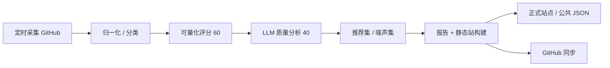

# Agent EcoRadar

[English](README.en.md) | 中文

> formerly Search in Coding

[](https://github.com/lzpgood123/agent-ecoradar/actions/workflows/update-data.yml)
[](https://github.com/lzpgood123/agent-ecoradar/actions/workflows/publish-site.yml)

> 自动扫描、评分并索引 AI Coding Agent 生态的持续雷达。  
> **不是** awesome list，而是持续运行的数据管道。

**站点**：https://ecoradar.lzpgood.online/  
**数据**：5,165 项目 · 推荐 40 · 噪声 10 · 目标工具 10  
**仓库**：https://github.com/lzpgood123/agent-ecoradar  
**版本**：`2026.07.16`

---

## 这是什么

Agent EcoRadar（智能体生态雷达）持续发现、归一化、评分并展示 AI Coding Agent 生态资源：插件、MCP、skills、rules、CLI 工具、agent 框架、教程与评测等。

| 维度 | 说明 |
|------|------|
| Eco | 生态全景：覆盖多工具与多资源类型 |
| Radar | 持续扫描：定时增量采集 + 周期深度分析 |
| Index | 可检索索引：站点筛选 / 搜索 / 公共 JSON |

GitHub 是完整数据与历史总仓库；正式站点是当前构建结果的公开展示面。

---

## AI 工作流



公开自动化由两部分组成：

1. **本地定时任务**：每日增量采集与评分；工作日增量 LLM 质量分析；周一全量 LLM 分析并部署站点。
2. **GitHub Actions**：数据更新校验、站点预览发布与质量门禁备份路径。

不依赖手工维护列表；维护者主要调整目标工具、查询与策略。

---

## 追踪范围

### 目标工具（10）

- Claude Code（`claude-code`）
- OpenAI Codex CLI（`codex-cli`）
- Antigravity / Gemini CLI（`antigravity-cli`）
- OpenCode（`opencode`）
- Goose（`goose`）
- Qoder（`qoder`）
- Trae（`trae`）
- WorkBuddy / CodeBuddy（`workbuddy-codebuddy`）
- Cursor（`cursor`）
- Hermes Agent（`hermes-agent`）

完整工具索引：[`docs/tool-index.md`](docs/tool-index.md)

### 资源类型（`resource_type`）

常见类型包括：`agent-framework`、`skills`、`cli-tool`、`mcp-server`、`tutorial`、`extension`、`rules` 等。  
站点支持按工具与类型多选筛选。

### 追踪分级（`tracking_priority`）

| 级别 | 含义 |
|------|------|
| `track` | 持续跟踪刷新 |
| `index` | 保留索引，较低刷新优先级 |
| `pending` | 待进一步判定 |
| `reject` | 低价值 / 噪声方向 |

---

## 评分（100 分制）

| 部分 | 分值 | 更新节奏 |
|------|------|----------|
| 可量化分 | 60 | 每日（stars、活跃度、源质量等） |
| LLM 质量分 | 40 | 周期 / 增量（质量、定位清晰度等） |
| **总分** | **100** | 合并展示 |

- 尚未完成 LLM 分析的项目，前端按 **/60** 展示可量化分。
- 自动维护 **curated** 推荐集与 **rejected** 噪声集（规则驱动，非人工逐条审核）。

---

## 仓库结构

```text
.
├── scripts/          # 采集、归一化、评分、构建、部署
├── tests/            # pytest
├── site/             # 静态站源码（零依赖 SPA）
├── data/             # projects / curated / seed-tools / queries 等
├── config/           # 评分等配置
├── docs/             # 稳定文档与自动报告
├── schemas/          # 数据模式
└── .github/          # Actions 与社区模板
```

---

## 站点与公共 JSON

- 正式站：https://ecoradar.lzpgood.online/
- 旧域名 `coding.lzpgood.online` 已 301 到新域（路径保留）
- 公共数据示例：
  - `/data/projects.json` — 精简列表
  - `/data/search-index.json` — 搜索索引
  - `/data/metrics.json` — 指标摘要
  - `/data/detail/` — 详情分片

站点特性：中英双语、多选标签筛选、分页表格、详情侧栏、报告弹窗、原生 SVG 图表。

---

## 自动化调度（中性说明）

| 节奏 | 内容 |
|------|------|
| 每日 | GitHub 增量采集 → 归一化 → 可量化评分 →（可选）分批元数据刷新 |
| 工作日 | 增量 LLM 质量分析 → 构建 → 部署正式站 |
| 每周一 | 全量 LLM 分析与基准更新 → 报告 → 构建 → 部署 |
| Actions | 校验、预览发布、质量门禁 |

本地环境需要 Python 3、虚拟环境依赖，以及已登录的 GitHub CLI（`gh`）用于仓库元数据。详见 [`CONTRIBUTING.md`](CONTRIBUTING.md)。

---

## 快速开始（只读 / 本地预览）

```bash
git clone https://github.com/lzpgood123/agent-ecoradar.git
cd agent-ecoradar
python3 -m venv .venv
source .venv/bin/activate
pip install -r requirements.txt   # 若仓库提供；或按 pyproject 安装
python3 scripts/build_site.py
# 使用任意静态服务器打开 site/
```

环境变量样例见 [`.env.example`](.env.example)（无真实密钥）。

---

## 贡献

欢迎：报告问题、请求新增追踪工具、修正数据字段、改进前端与文档。

- 贡献指南：[`CONTRIBUTING.md`](CONTRIBUTING.md)
- 新工具清单：[`docs/add-new-tool-checklist.md`](docs/add-new-tool-checklist.md)
- Issue / PR 模板：`.github/`

## License

[MIT](LICENSE) © 2026 lzpgood123
