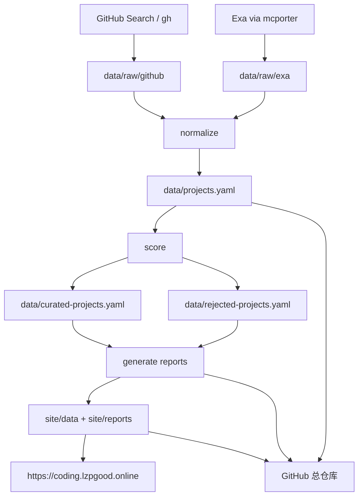

# Search in Coding：AI Coding Agent 生态追踪索引库

[](https://github.com/lzpgood123/search-in-coding/actions/workflows/update-data.yml)
[](https://github.com/lzpgood123/search-in-coding/actions/workflows/publish-site.yml)

> 面向终端型 / Agentic AI Coding 工具的长期自动追踪索引库。GitHub 是完整数据与历史总仓库，正式站点是当前构建结果的公开展示面。

- **正式站点**：<https://coding.lzpgood.online/>
- **GitHub 总仓库**：<https://github.com/lzpgood123/search-in-coding>
- **当前版本**：`2026.07.06`
- **维护模式**：Hermes 每日自动采集与分析；每周正式更新；可人工要求立即更新
- **站点语言**：中文 / English 双语切换；新导入数据保留 `i18n.zh/en` 展示结构
- **数据规模**：618 条归一化记录，60 条自动推荐，25 条自动低质/噪声记录

---

## 目录

- [项目定位](#项目定位)
- [追踪范围](#追踪范围)
- [AI 工具分类入口](#ai-工具分类入口)
- [仓库文件说明](#仓库文件说明)
- [数据流与自动化](#数据流与自动化)
- [核心报告](#核心报告)
- [如何立即更新](#如何立即更新)
- [维护原则](#维护原则)

---

## 项目定位

Search in Coding 不是普通 awesome list，而是一个**持续自动更新的 AI Coding Agent 生态索引库**。它追踪工具本体、插件、MCP/ACP/A2A、skills、rules、prompts、上下文工程、PR review、CI 自动化、教程、案例和评测资源。

核心目标：

1. 每天自动发现新资料；
2. 自动归一化、评分、分类；
3. 自动维护推荐集与噪声集；
4. 将 raw 数据、索引、报告、站点数据全部同步到 GitHub；
5. 通过正式站点展示当前生态状态。

---

## 追踪范围

### 目标工具

- **Claude Code**（`claude-code`）：terminal-agent，扩展点：skills, hooks, slash-commands, mcp, subagents
- **OpenAI Codex CLI**（`codex-cli`）：terminal-agent，扩展点：skills, slash-commands, execution-policy, hooks, github-pr
- **Antigravity CLI / Gemini CLI**（`antigravity-cli`）：terminal-agent，扩展点：plugins, skills, mcp, a2a, hooks, subagents
- **OpenCode**（`opencode`）：terminal-agent，扩展点：commands, agents, mcp, lsp, sourcegraph
- **Goose**（`goose`）：terminal-agent，扩展点：mcp extensions, recipes, subagents, acp, local models
- **Qoder / QoderWork**（`qoder`）：ai-ide，扩展点：skills, plugins, mcp, repo-wiki
- **Trae / Trae Work**（`trae`）：ai-ide，扩展点：mcp, skills, agent-system, online-search
- **WorkBuddy / CodeBuddy**（`workbuddy-codebuddy`）：ai-ide，扩展点：mcp, skills, connectors, craft-agent
- **Cursor**（`cursor`）：ai-ide，扩展点：rules, skills, mcp, hooks, cloud-agents, bugbot
- **Hermes Agent**（`hermes-agent`）：persistent-agent，扩展点：skills, cron, memory, delegation, tools, mcp

### 生态分类

- `agent-harness`：363 条
- `testing-review-ci`：357 条
- `skills-prompts`：195 条
- `mcp-acp-a2a`：162 条
- `rules-instructions`：135 条
- `context-engineering`：108 条
- `terminal-agent`：37 条
- `benchmark-evaluation`：31 条
- `tutorial-case-study`：24 条
- `official-tool`：10 条
- `ai-ide`：4 条
- `persistent-agent`：1 条

---

## AI 工具分类入口

完整工具索引：[`docs/tool-index.md`](docs/tool-index.md)

| 工具 | 类型 | 当前记录数 | 入口 |
|---|---|---:|---|
| Claude Code | `terminal-agent` | 108 | [`claude-code`](docs/tool-index.md#claude-code-claude-code) |
| OpenAI Codex CLI | `terminal-agent` | 61 | [`codex-cli`](docs/tool-index.md#openai-codex-cli-codex-cli) |
| Antigravity CLI / Gemini CLI | `terminal-agent` | 68 | [`antigravity-cli`](docs/tool-index.md#antigravity-cli---gemini-cli-antigravity-cli) |
| OpenCode | `terminal-agent` | 59 | [`opencode`](docs/tool-index.md#opencode-opencode) |
| Goose | `terminal-agent` | 45 | [`goose`](docs/tool-index.md#goose-goose) |
| Qoder / QoderWork | `ai-ide` | 57 | [`qoder`](docs/tool-index.md#qoder---qoderwork-qoder) |
| Trae / Trae Work | `ai-ide` | 25 | [`trae`](docs/tool-index.md#trae---trae-work-trae) |
| WorkBuddy / CodeBuddy | `ai-ide` | 55 | [`workbuddy-codebuddy`](docs/tool-index.md#workbuddy---codebuddy-workbuddy-codebuddy) |
| Cursor | `ai-ide` | 72 | [`cursor`](docs/tool-index.md#cursor-cursor) |
| Hermes Agent | `persistent-agent` | 53 | [`hermes-agent`](docs/tool-index.md#hermes-agent-hermes-agent) |

---

## 仓库文件说明

| 路径 | 作用 |
|---|---|
| `data/raw/` | GitHub / Exa / fallback web 原始采集快照，保留来源证据 |
| `data/projects.yaml` | 全量归一化索引库，GitHub 总仓库的核心数据 |
| `data/curated-projects.yaml` | 自动评分推荐集，不再依赖人工审核 |
| `data/rejected-projects.yaml` | 自动低质、噪声、弱相关或低可信记录 |
| `data/scores.yaml` | 每条记录的评分结果 |
| `data/seed-tools.yaml` | 目标 AI Coding 工具清单 |
| `data/queries.yaml` | GitHub / Exa 搜索 query 配置 |
| `docs/tool-index.md` | 按 AI 工具组织的分类索引 |
| `docs/reports/` | 自动生成的分析报告 |
| `docs/releases/` | 日期版本发布说明 |
| `site/` | 静态站点源码与站点数据 |
| `scripts/` | 采集、归一化、评分、报告、构建、部署脚本 |
| `.github/workflows/` | GitHub Actions 自动更新与 Pages 预览 |
| `.hermes/cron-prompts/` | Hermes 长期运行任务提示词 |
| `VERSION` / `CHANGELOG.md` | 日期版本号与变更记录 |

---

## 数据流与自动化



### 服务器 Hermes cron

- 每日 03:00：自动收集与分析，部署正式站点，并推送 GitHub。
- 每周一 09:00：较大范围更新并生成周报。

### GitHub Actions

- `Update Data`：在 GitHub 环境中收集/分析/提交数据，默认不部署服务器；服务器 cron 显式使用 `--deploy`。
- `Publish Site`：发布 GitHub Pages 预览。

---

## 核心报告

| 报告 | 说明 |
|---|---|
| [`docs/reports/final-delivery-report.md`](docs/reports/final-delivery-report.md) | 总体数据规模、来源分布、Top 项目 |
| [`docs/reports/curated-top-projects.md`](docs/reports/curated-top-projects.md) | 自动评分推荐项目榜 |
| [`docs/reports/tool-ecosystem-comparison.md`](docs/reports/tool-ecosystem-comparison.md) | 各目标工具生态对比 |
| [`docs/reports/trends-and-opportunities.md`](docs/reports/trends-and-opportunities.md) | 趋势与机会 |
| [`docs/reports/source-quality-audit.md`](docs/reports/source-quality-audit.md) | 来源质量审计 |
| [`docs/reports/exa-status-and-fallback.md`](docs/reports/exa-status-and-fallback.md) | Exa 状态与 fallback 标注 |
| [`docs/reports/optimization-backlog.md`](docs/reports/optimization-backlog.md) | 全流程体检与优化清单 |
| [`docs/security-hardening.md`](docs/security-hardening.md) | 正式站点安全加固说明 |
| [`docs/github-source-of-truth.md`](docs/github-source-of-truth.md) | GitHub 总仓库原则 |
| [`docs/auto-maintenance-plan.md`](docs/auto-maintenance-plan.md) | 全自动维护方案 |

---

## 如何立即更新

在服务器工作区执行：

```bash
cd "/root/workspace/search in coding"
git pull --ff-only origin main
python3 scripts/update_tracker.py --github-limit 50 --exa-limit 5 --deploy
git status --short
```

如有变化：

```bash
git add -A
git commit -m "chore(data): auto update tracker snapshot"
git push origin main
```

GitHub Actions 也可以手动触发 `Update Data` workflow。

---

---

## 维护原则

1. **GitHub 是总仓库**：所有 raw、data、reports、site data、版本记录都必须回写 GitHub。
2. **正式站点是展示面**：`https://coding.lzpgood.online/` 展示当前构建结果。
3. **全自动评分优先**：不再进行逐条人工审核。
4. **来源透明**：Exa、GitHub、fallback-web 必须清楚标注。
5. **日期版本迭代**：重要更新使用 `YYYY.MM.DD` 版本号。
6. **可复用**：替换 `seed-tools` 和 `queries` 后可迁移到其他技术生态追踪。

## Additional operation docs

- [`docs/data-api.md`](docs/data-api.md) | Public JSON data API |
- [`docs/raw-data-retention.md`](docs/raw-data-retention.md) | Raw evidence retention/archive policy |
- [`docs/ecosystem-tracker-template.md`](docs/ecosystem-tracker-template.md) | Reuse this project as an ecosystem tracker template |
